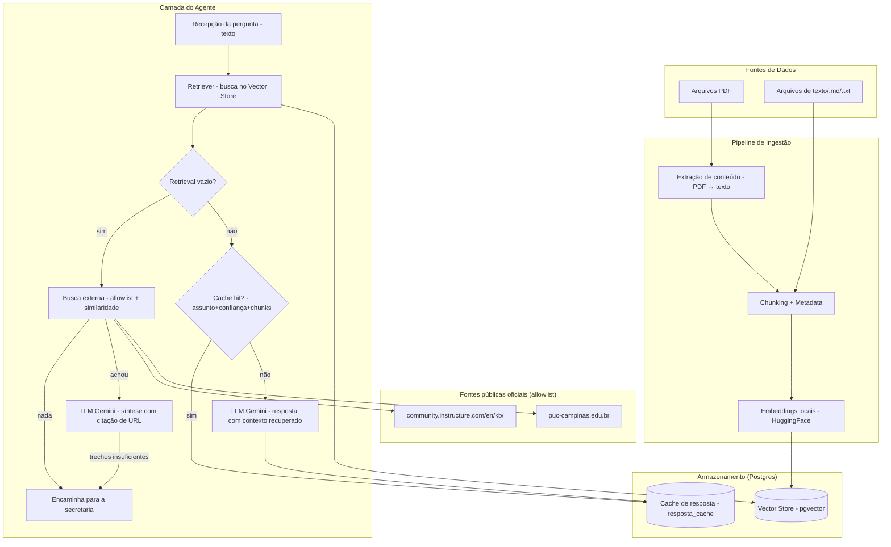

# Arquitetura — Agente de IA para Suporte ao Aluno EAD (v0 — modelo inicial simplificado)

## Visão geral

Modelo inicial simplificado: RAG (Retrieval-Augmented Generation) consumindo
arquivos PDF e texto como base de conhecimento, com um fallback de busca em
páginas públicas oficiais quando o retrieval não encontra nada. Sem ingestão por
scraping, interpretação de print ou escalonamento. Este documento é o diagrama e a lista
de componentes; o estado de implementação, contagem de testes e instruções de
uso ficam no [README.md](README.md) — mantenha os dois em sincronia ao mexer
na estrutura.

## Componentes

### 1. Ingestão
- Extrair texto de PDFs (`pypdf`)
- Ler arquivos `.txt`/`.md` diretamente
- Dividir o conteúdo em chunks (por parágrafo ou tamanho fixo com overlap)
- Gerar embeddings dos chunks com um modelo local (HuggingFace/
  sentence-transformers, multilíngue — sem depender de cota de API) e indexar
  no vector store

### 2. Vector Store
- Armazena chunks + embeddings + metadata (origem do arquivo, página)
- Opção mais simples para começar local: pgvector

### 3. Agente (runtime)
- Recebe a pergunta do usuário (texto)
- Busca os chunks mais relevantes no vector store (retrieval)
- Se nenhum chunk recuperado passa do limiar de relevância, não chama o LLM
  com contexto vazio: aciona a busca externa restrita (componente 5)
- Antes de chamar o LLM, verifica o cache de resposta pela chave
  `assunto + confiança + ids dos chunks recuperados` (não pelo texto da
  pergunta — ver componente 4); em hit, devolve a resposta cacheada com as
  fontes do retrieval atual
- Em miss, envia pergunta + contexto recuperado para o LLM (Gemini) gerar a
  resposta, e grava o resultado no cache

### 4. Cache de resposta
- Evita chamar o LLM de novo quando perguntas diferentes (inclusive
  paráfrases) recuperam o mesmo conjunto de chunks no retrieval
- Chave = `assunto + nível de confiança (is_exact_match) + ids ordenados dos
  chunks recuperados` — não o texto da pergunta, para não depender de
  similaridade textual/embedding e não arriscar falso-positivo entre
  perguntas parecidas mas com resposta diferente
- Guardado numa tabela própria (`resposta_cache`) no mesmo Postgres da
  ingestão — nenhum serviço novo. Reingerir um arquivo alterado muda os ids
  dos chunks recuperados e invalida a chave automaticamente

### 5. Fallback de busca externa
- Acionado **apenas** no ramo em que o retrieval volta vazio: as perguntas que a
  base responde bem não pagam a latência da busca
- Não é uma tool escolhida pelo LLM — o gatilho é uma condição determinística
  (`if not chunks`), o que mantém o comportamento testável e previsível
- Restrição de domínio em duas camadas: uma query `site:<host>` por entrada da
  allowlist (recall) e a revalidação de **toda** URL devolvida contra
  `(host, path_prefix)` (garantia). O operador `site:` sozinho vaza resultado
  fora do escopo em silêncio, então não é tratado como restrição
- Cascata de filtros, do mais barato ao mais caro: allowlist → similaridade
  (embedding local, sem custo de API) → veto do LLM, que responde `INSUFICIENTE`
  quando os trechos não bastam
- Registro acadêmico e financeiro (nota, matrícula, boleto…) nunca vão para a
  busca externa: a resposta depende do caso do aluno, e uma página pública
  responderia com confiança aparente e conteúdo errado
- Qualquer falha da busca (rate limit, mudança no HTML do buscador) degrada para
  o encaminhamento à secretaria — nunca vira erro para o usuário
- Sem cache: a chave do componente 4 depende de ids de chunk, que não existem
  aqui, e conteúdo externo muda sem aviso
- `Answer.grounded` continua `False` quando a web responde (a informação não
  estava na base — sinal de documento faltando na ingestão); `Answer.origem`
  distingue `base` / `web` / `nenhuma`

## Fora do escopo (por enquanto)
- Ingestão por web scraping do site da PUC (o fallback busca em tempo real, não
  indexa)
- Leitura da página completa dos resultados da busca (hoje só os snippets)
- Interpretação de print/imagem
- Classificador de intenção / escalonamento para humano
- Canal de atendimento (WhatsApp, portal, etc.)

## Stack mínima sugerida
- Python + FastAPI (endpoint simples de pergunta/resposta)
- `pypdf` para extrair texto do PDF
- pgvector como vector store e como armazenamento do cache de resposta (roda
  local, sem infra extra)
- Embeddings locais (HuggingFace/sentence-transformers) e API do Gemini para
  geração da resposta
- `ddgs` para a busca externa (sem API oficial; degrada para o encaminhamento à
  secretaria quando falha)

## Estrutura atual
agente-suporte-ead/
├── app/
│   ├── main.py                    # entrypoint: app = create_app()
│   ├── api/
│   │   ├── app.py                   # create_app(), lifespan com warm-up, middleware
│   │   ├── schemas.py                # AskRequest/AskResponse/SourceOut (Pydantic)
│   │   ├── deps.py                   # request_id, assuntos válidos (injetáveis)
│   │   ├── errors.py                 # envelope de erro único + exception handlers
│   │   └── routers/v1.py             # POST /v1/ask, GET /v1/health, GET /v1/assuntos
│   ├── core/
│   │   ├── config.py               # configs via .env (chunk size, thresholds, CACHE_ENABLED etc.)
│   │   └── models.py                # contratos: Query, RetrievedChunk, Answer
│   ├── providers/
│   │   └── gemini.py                # único ponto que conhece o provedor de IA
│   │                                 #   (embeddings locais HuggingFace + chat Gemini)
│   ├── ingestion/
│   │   ├── loaders/
│   │   │   └── registry.py          # fonte (pdf/txt/md) -> Document, por extensão
│   │   ├── chunker.py                # divide em chunks + content_hash/chunk_id (função pura)
│   │   └── pipeline.py               # orquestra load -> chunk -> embed -> indexa (idempotente)
│   ├── retrieval/
│   │   └── retriever.py              # busca por similaridade + filtro por assunto + is_exact_match
│   ├── agent/
│   │   ├── preprocess.py             # normaliza a Query (ponto de entrada p/ anexos no futuro)
│   │   ├── prompts.py                 # templates de prompt (base, alta confiança e web)
│   │   ├── web_fallback.py            # busca externa restrita à allowlist de domínios oficiais
│   │   └── responder.py               # orquestra retrieval -> cache -> prompt -> LLM
│   └── db/
│       ├── vector_store.py            # conexão com pgvector + operações de schema da ingestão
│       └── response_cache.py          # cache de resposta por conjunto de chunks (mesmo Postgres)
│
├── data/
│   └── raw/
│       ├── canvas/                    # PDFs/texto sobre o Canvas
│       └── puc-digital/               # PDFs/texto sobre PUC Digital
│
├── scripts/
│   ├── ingest.py                      # CLI: indexa um ou mais assuntos
│   ├── ask.py                         # CLI: pergunta, com --debug para chunks/scores
│   └── list_ingested.py               # CLI: lista arquivos já indexados
│
├── tests/
│   ├── test_chunker.py                # chunking, content_hash, chunk_id determinístico
│   ├── test_retrieval.py              # corte por limiar, filtro por assunto, is_exact_match
│   ├── test_responder.py              # guardrail, prompt de alta confiança, hit/miss de cache
│   └── test_web_fallback.py           # allowlist, corte por similaridade, blocklist, degradação
│
├── docker-compose.yml                 # Postgres + pgvector
├── requirements.txt
├── .env.example                        # DATABASE_URL, GOOGLE_API_KEY, CACHE_ENABLED, WEB_FALLBACK_ENABLED etc.
└── README.md