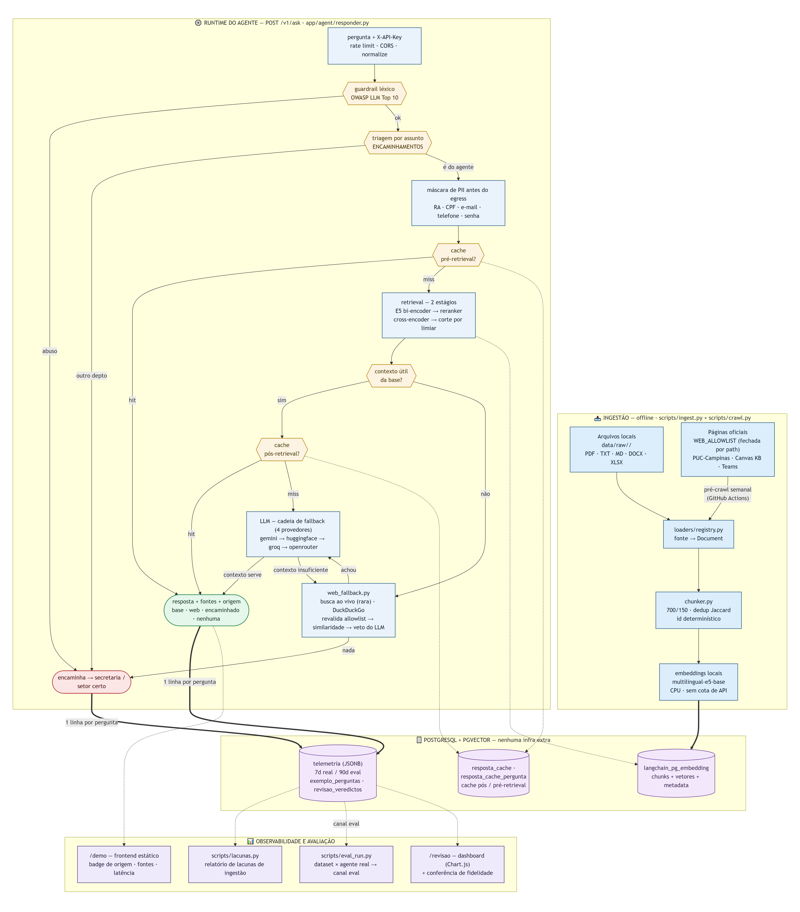

# Arquitetura — Agente de IA para Suporte ao Aluno EAD (v1)

## Visão geral

RAG (Retrieval-Augmented Generation) sobre uma base local (PDF, texto, DOCX e a
planilha de modelos de e-mail) somada às páginas oficiais da `WEB_ALLOWLIST`
pré-indexadas pelo crawler (`scripts/crawl.py`); quando nem a base nem o conteúdo
crawlado cobrem a pergunta, um fallback faz busca ao vivo restrita à mesma
allowlist antes de encaminhar para a secretaria. Fora do escopo: interpretação de
print, APIs em tempo real e escalonamento para humano. Este documento é o
diagrama e a lista de componentes; o estado de implementação, contagem de testes
e instruções de uso ficam no [README.md](README.md) — mantenha os dois em
sincronia ao mexer na estrutura.

Fonte do diagrama (mermaid):
[Prints/arquitetura-agente-ia-suporte-ead-v0.mermaid](Prints/arquitetura-agente-ia-suporte-ead-v0.mermaid).

O hit **pré-retrieval** devolve `origem="base"` sem tocar em pgvector, reranker
nem LLM. O hit **pós-retrieval** vem depois da busca e do rerank e só poupa a
chamada ao LLM. Uma resposta nova de base grava nas duas camadas. Como a chave do
cache pré-retrieval não tem os ids dos chunks, cada reingestão
(`pipeline._indexar_chunks`) limpa a tabela inteira — é a invalidação da camada.

Antes do retrieval, dois guardrails léxicos: o **guardrail de entrada**
(injeção/abuso, OWASP LLM Top 10) e a **triagem por assunto** (perguntas de outro
departamento), os dois com desfecho `origem="encaminhado"`. Depois deles, o
**mascaramento de PII** (RA/CPF/e-mail/telefone/senha) roda antes de qualquer
egress (LLM nos EUA, busca externa).

## Componentes

### 1. Ingestão
- Extrair texto de PDFs (`pypdf`)
- Ler arquivos `.txt`/`.md` diretamente
- Dividir o conteúdo em chunks (por parágrafo ou tamanho fixo com overlap)
- Gerar embeddings dos chunks com um modelo local (HuggingFace/
  sentence-transformers, multilíngue — sem depender de cota de API) e indexar
  no vector store

### 2. Vector Store
- Armazena chunks + embeddings + metadata (origem do arquivo, página)
- Opção mais simples para começar local: pgvector

### 3. Agente (runtime)
- Recebe a pergunta do usuário (texto)
- **Cache pré-retrieval** (componente 4a): antes do retrieval, checa a chave
  `pergunta normalizada + assunto`. Em hit, devolve a resposta da base sem
  tocar em pgvector, reranker nem LLM
- Em miss, busca os chunks mais relevantes no vector store (retrieval de 2
  estágios: bi-encoder E5 → reranker cross-encoder)
- Se nenhum chunk recuperado passa do limiar de relevância, não chama o LLM
  com contexto vazio: aciona a busca externa restrita (componente 5)
- Antes de chamar o LLM, verifica o **cache pós-retrieval** (componente 4b)
  pela chave `pergunta + assunto + ids dos chunks + modelo`; em hit, devolve a
  resposta cacheada com as fontes do retrieval atual
- Em miss, envia pergunta + contexto recuperado para o LLM (Gemini) gerar a
  resposta, e grava o resultado **nas duas camadas de cache**

### 4. Cache de resposta (duas camadas)

**4a. Pré-retrieval (`resposta_cache_pergunta`)**
- Chave = `pergunta normalizada + assunto`, sem os ids dos chunks
- Um hit pula o pipeline inteiro (pgvector + cross-encoder + LLM), não só a
  chamada ao LLM
- Só o desfecho `origem="base"` bem-sucedido é gravado (veto de contexto, web e
  encaminhamento não entram)
- Como a chave não sabe que a base mudou, a invalidação é **explícita**: toda
  reingestão (`pipeline._indexar_chunks`, o choke point único de escrita no
  índice), o `remove_ingested` e o prune do `crawl` limpam a tabela
- Desligado no canal `eval` (a suíte precisa medir retrieval + rerank) e com
  `--modelo`/`modelo` (a chave não carrega o modelo)
- Na telemetria: `cache_pre_retrieval=true`, com `ms_retrieve`/`ms_rerank` nulos

**4b. Pós-retrieval (`resposta_cache`)**
- Chave = `pergunta + assunto + ids ordenados dos chunks recuperados + modelo`
- Um hit evita só a chamada ao LLM — a busca e o rerank já rodaram
- Reingerir um arquivo alterado muda os ids dos chunks recuperados e invalida a
  chave automaticamente, sem tabela de invalidação
- A pergunta entra na chave (desde T2.4) para não servir a resposta de uma
  pergunta à outra que por acaso recuperou os mesmos chunks

Ambas ficam em tabela própria no mesmo Postgres da ingestão — nenhum serviço
novo. `CACHE_ENABLED` desliga as duas; `scripts/clear_cache.py` apaga as duas.

### 5. Fallback de busca externa
- Acionado **apenas** no ramo em que o retrieval volta vazio: as perguntas que a
  base responde bem não pagam a latência da busca
- Não é uma tool escolhida pelo LLM — o gatilho é uma condição determinística
  (`if not chunks`), o que mantém o comportamento testável e previsível
- Restrição de domínio em duas camadas: uma query `site:<host>` por entrada da
  allowlist (recall) e a revalidação de **toda** URL devolvida contra
  `(host, path_prefixes)` (garantia). O operador `site:` sozinho vaza resultado
  fora do escopo em silêncio, então não é tratado como restrição
- Cascata de filtros, do mais barato ao mais caro: allowlist → similaridade
  (embedding local, sem custo de API) → veto do LLM, que responde `INSUFICIENTE`
  quando os trechos não bastam
- Registro acadêmico e financeiro (nota, matrícula, boleto…) nunca vão para a
  busca externa: a resposta depende do caso do aluno, e uma página pública
  responderia com confiança aparente e conteúdo errado
- Qualquer falha da busca (rate limit, mudança no HTML do buscador) degrada para
  o encaminhamento à secretaria — nunca vira erro para o usuário
- Sem cache: a chave do 4b depende de ids de chunk, que não existem aqui, e o 4a
  só grava o desfecho `origem="base"`; além disso conteúdo externo muda sem aviso
- `Answer.grounded` continua `False` quando a web responde (a informação não
  estava na base — sinal de documento faltando na ingestão); `Answer.origem`
  distingue `base` / `web` / `nenhuma`

## Fora do escopo (por enquanto)
- Busca híbrida (BM25 + vetor) — eixo de recall, ortogonal ao reranker
- Leitura da página completa dos resultados da busca ao vivo (hoje só os snippets;
  o pré-crawl já indexa o conteúdo inteiro das páginas da allowlist)
- Interpretação de print/imagem
- Classificador de intenção / escalonamento para humano
- Canal de atendimento (WhatsApp, portal, etc.)

## Stack mínima sugerida
- Python + FastAPI (endpoint simples de pergunta/resposta)
- `pypdf` para extrair texto do PDF
- pgvector como vector store e como armazenamento do cache de resposta (roda
  local, sem infra extra)
- Embeddings locais (HuggingFace/sentence-transformers) e API do Gemini para
  geração da resposta
- `ddgs` para a busca externa (sem API oficial; degrada para o encaminhamento à
  secretaria quando falha)

## Estrutura atual
agente-suporte-ead/
├── app/
│   ├── main.py                    # entrypoint: app = create_app()
│   ├── api/
│   │   ├── app.py                   # create_app(), lifespan com warm-up, middleware
│   │   ├── schemas.py                # AskRequest/AskResponse/SourceOut (Pydantic)
│   │   ├── deps.py                   # request_id, assuntos válidos (injetáveis)
│   │   ├── errors.py                 # envelope de erro único + exception handlers
│   │   └── routers/v1.py             # POST /v1/ask, GET /v1/health, GET /v1/assuntos
│   ├── core/
│   │   ├── config.py               # configs via .env (chunk size, thresholds, CACHE_ENABLED etc.)
│   │   └── models.py                # contratos: Query, RetrievedChunk, Answer
│   ├── providers/                   # único ponto que conhece um SDK de LLM
│   │   ├── base.py                  # interface LLMProvider + quando cair p/ o próximo
│   │   ├── chain.py                 # cadeia de fallback (gemini -> groq -> openrouter)
│   │   ├── gemini.py                # provider 1: gemini-3.6-flash
│   │   ├── openai_compat.py         # providers 2 e 3: Groq e OpenRouter (API OpenAI)
│   │   └── embeddings.py            # embeddings locais (HuggingFace) — não é chat
│   ├── ingestion/
│   │   ├── loaders/
│   │   │   └── registry.py          # fonte (pdf/txt/md) -> Document, por extensão
│   │   ├── chunker.py                # divide em chunks + content_hash/chunk_id (função pura)
│   │   └── pipeline.py               # orquestra load -> chunk -> embed -> indexa (idempotente)
│   ├── retrieval/
│   │   ├── retriever.py              # busca por similaridade (2 estágios) + filtro por assunto
│   │   └── reranker.py               # 2º estágio: cross-encoder reordena os candidatos do E5
│   ├── agent/
│   │   ├── preprocess.py             # normaliza a Query (ponto de entrada p/ anexos no futuro)
│   │   ├── prompts.py                 # templates de prompt (base, alta confiança e web)
│   │   ├── web_fallback.py            # busca externa restrita à allowlist de domínios oficiais
│   │   └── responder.py               # orquestra pré-cache -> retrieval -> pós-cache -> prompt -> LLM
│   └── db/
│       ├── vector_store.py            # conexão com pgvector + operações de schema da ingestão
│       ├── response_cache.py          # cache PÓS-retrieval — por pergunta + assunto + chunks
│       └── pre_retrieval_cache.py     # cache PRÉ-retrieval — por pergunta + assunto (invalidado na reingestão)
│
├── data/
│   └── raw/
│       ├── canvas/                    # PDFs/texto sobre o Canvas
│       └── puc-digital/               # PDFs/texto sobre PUC Digital
│
├── scripts/
│   ├── ingest.py                      # CLI: indexa um ou mais assuntos
│   ├── ask.py                         # CLI: pergunta, com --debug para chunks/scores
│   └── list_ingested.py               # CLI: lista arquivos já indexados
│
├── tests/
│   ├── test_chunker.py                # chunking, content_hash, chunk_id determinístico
│   ├── test_retrieval.py              # corte por limiar, filtro por assunto, is_exact_match
│   ├── test_responder.py              # guardrail, prompt de alta confiança, hit/miss dos dois caches
│   ├── test_pre_retrieval_cache.py    # store do cache pré-retrieval (round-trip de fontes, INF-11)
│   └── test_web_fallback.py           # allowlist, corte por similaridade, blocklist, degradação
│
├── docker-compose.yml                 # Postgres + pgvector
├── requirements.txt
├── .env.example                        # DATABASE_URL, LLM_PROVIDERS, GEMINI/GROQ/OPENROUTER_API_KEY, CACHE_ENABLED etc.
└── README.md