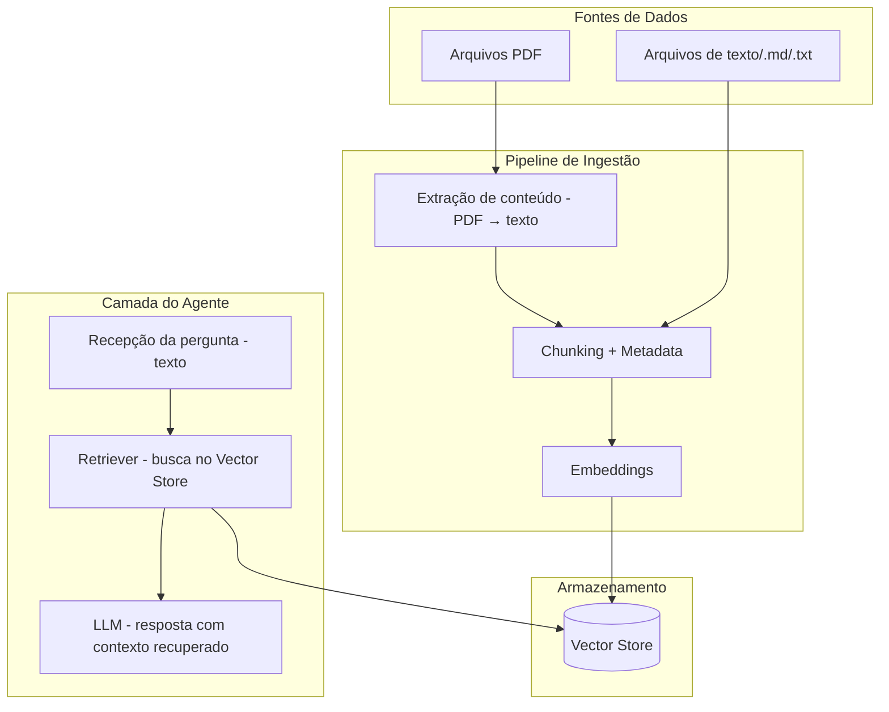

# Arquitetura — Agente de IA para Suporte ao Aluno EAD (v0 — modelo inicial simplificado)

## Visão geral

Modelo inicial simplificado: RAG (Retrieval-Augmented Generation) consumindo
apenas arquivos PDF e texto como base de conhecimento, sem web scraping,
interpretação de print ou escalonamento.

## Componentes

### 1. Ingestão
- Extrair texto de PDFs (`pypdf` ou `pdfplumber`)
- Ler arquivos `.txt`/`.md` diretamente
- Dividir o conteúdo em chunks (por parágrafo ou tamanho fixo com overlap)
- Gerar embeddings dos chunks e indexar no vector store

### 2. Vector Store
- Armazena chunks + embeddings + metadata (origem do arquivo, página)
- Opção mais simples para começar local: pgvector

### 3. Agente (runtime)
- Recebe a pergunta do usuário (texto)
- Busca os chunks mais relevantes no vector store (retrieval)
- Envia pergunta + contexto recuperado para o LLM gerar a resposta

## Fora do escopo (por enquanto)
- Web scraping do site da PUC
- Interpretação de print/imagem
- Classificador de intenção / escalonamento para humano
- Canal de atendimento (WhatsApp, portal, etc.)

## Stack mínima sugerida
- Python + FastAPI (endpoint simples de pergunta/resposta)
- `pypdf` ou `pdfplumber` para extrair texto do PDF
- pgvector como vector store (roda local, sem infra extra)
- API do gemini para embeddings/geração 

## Estutura inicial
agente-suporte-ead/
├── app/
│   ├── main.py                 # FastAPI - entrypoint, endpoint de pergunta/resposta
│   ├── config.py                # configs (conexão pgvector, chunk size, etc.)
│   ├── ingestion/
│   │   ├── loader.py            # lê PDFs/txt por pasta de assunto
│   │   ├── chunker.py           # divide o texto em chunks
│   │   └── embedder.py          # gera embeddings e grava no pgvector
│   ├── retrieval/
│   │   └── retriever.py         # busca os chunks mais relevantes no pgvector
│   ├── agent/
│   │   └── responder.py         # monta prompt (pergunta + contexto) e chama o LLM
│   └── db/
│       ├── models.py             # schema da tabela de embeddings (pgvector)
│       └── session.py            # conexão com o Postgres
│
├── data/
│   └── raw/
│       ├── canvas/               # PDFs/texto sobre o Canvas
│       └── puc-digital/          # PDFs/texto sobre PUC Digital
│
├── scripts/
│   └── ingest.py                 # script CLI para rodar a ingestão de uma pasta/assunto
│
├── tests/
│   └── test_retrieval.py         # testes de validação do retrieval
│
├── requirements.txt
├── .env.example                  # DATABASE_URL,  Google_API_KEY etc.
└── README.md